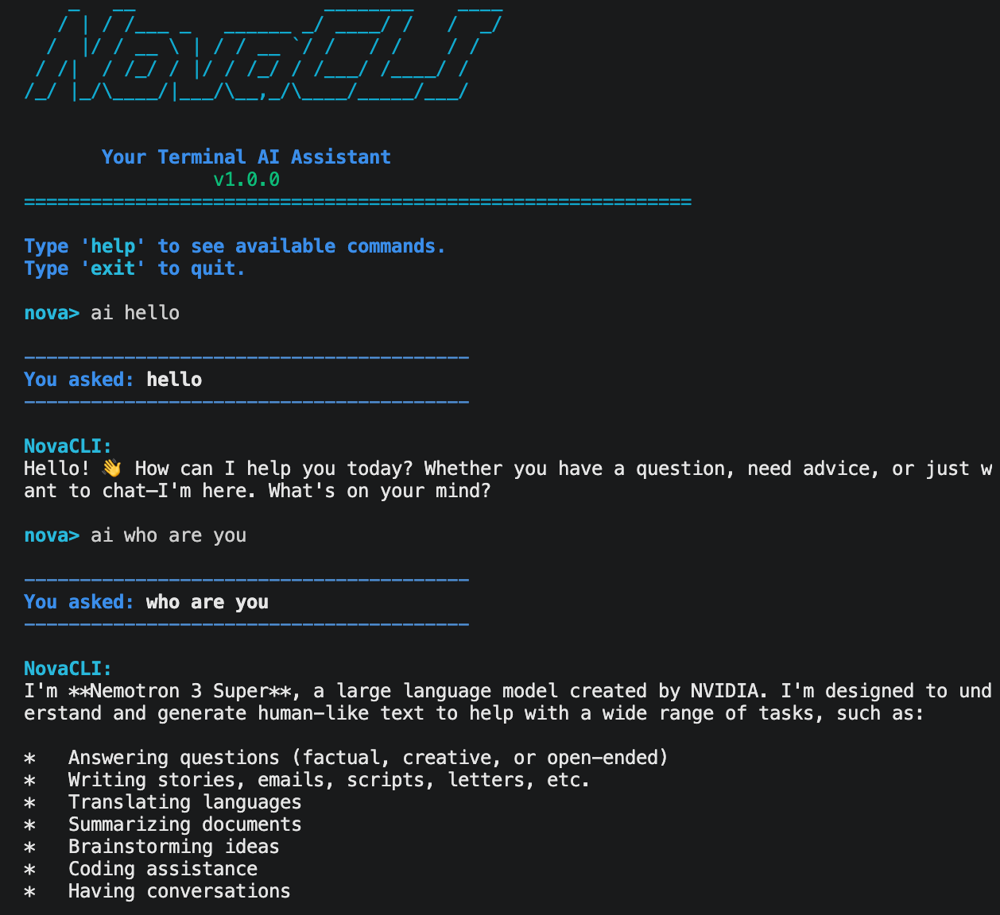

# NovaCLI Assistant

A colorful terminal-based AI assistant with a professional developer-style interface. Built with Python, featuring AI chat via OpenRouter API, calculator, notes system, and more.



## Features

- AI Chat using OpenRouter API (DeepSeek model)
- Current time & date display
- Built-in calculator
- Notes manager (add/list/delete)
- Random programming jokes
- Command history tracking
- Clean, colorful CLI interface

## Commands

| Command  | Description                  |
|----------|------------------------------|
| `help`   | Show available commands      |
| `time`   | Display current time         |
| `date`   | Display current date         |
| `calc`   | Open the calculator          |
| `ai`     | Ask NovaCLI AI anything      |
| `notes`  | Open notes manager           |
| `joke`   | Get a random programming joke|
| `history`| Show command history         |
| `clear`  | Clear the terminal screen    |
| `exit`   | Exit NovaCLI Assistant       |

## Installation

### 1. Clone or download the project

```bash
cd NovaCLI-Assistant
```

### 2. Install dependencies

```bash
pip install -r requirements.txt
```

### 3. Set up your API key

1. Open the `.env` file in the project folder
2. Replace `your-api-key-here` with your actual OpenRouter API key

```
OPENROUTER_API_KEY=sk-or-v1-your-actual-key-here
```

> **Don't have an API key?** Sign up at [openrouter.ai](https://openrouter.ai) and generate a free API key. The model used (`deepseek/deepseek-chat-v3-0324:free`) is free to use.

### 4. Run NovaCLI

```bash
python main.py
```

## Project Structure

```
NovaCLI-Assistant/
├── main.py          # Main entry point & CLI loop
├── ai_module.py     # OpenRouter API integration
├── commands.py      # All command handlers
├── config.py        # Colors, constants, config
├── history.txt      # Saved command history
├── notes.txt        # Saved notes
├── .env             # API key (your secret)
├── requirements.txt # Python dependencies
└── README.md        # This file
```

## Requirements

- Python 3.7+
- Internet connection (for AI chat)
- OpenRouter API key (free)

## License

MIT
